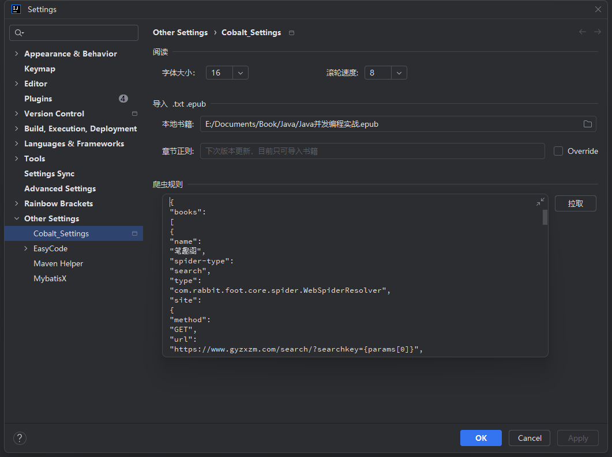
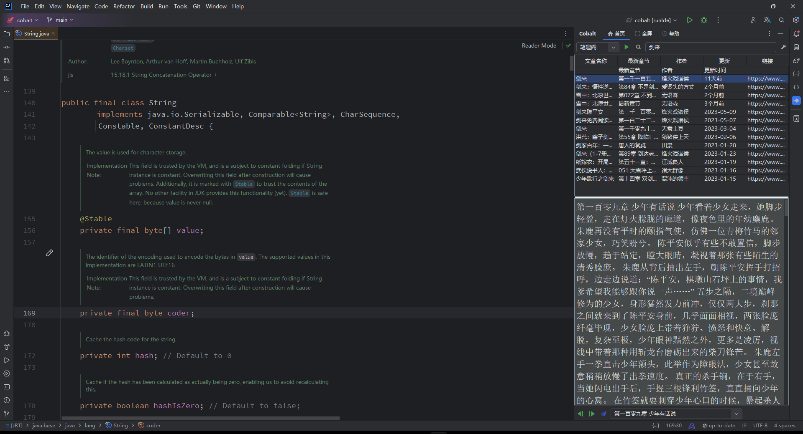
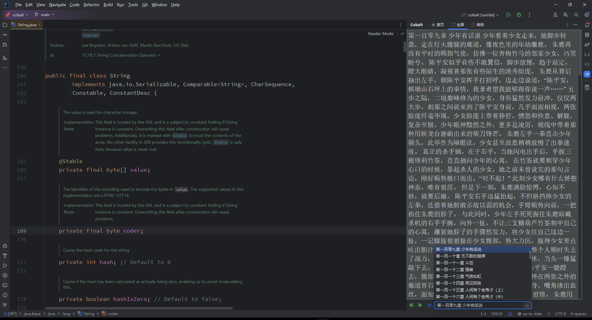

    

<h1 align="center">Cobalt</h1>

适用于基于 IntelliJ 的 IDE/Android Studio/HUAWEI DevEco Studio

## 兼容性

IntelliJ IDEA(Ultimate/Community/Educational), PhpStorm, WebStorm, PyCharm(Professional/Community/Educational), RubyMine, AppCode, CLion, CLion(Nova), Gogland, DataGrip, Rider, MPS, Android Studio, HUAWEI DevEco Studio, DataSpell, Code With Me(Host), RustRover, Aqua

## 安装

### 将其安装在你的 IDE 中

 
Windows 和 Linux - File> Settings> Plugins> Marketplace> Search for "Cobalt"> Install Plugin>Restart IntelliJ IDEA

Mac — IntelliJ IDEA> Preferences> Plugins> Marketplace> Search for "Cobalt"> Install Plugin >Restart IntelliJ IDEA

## 搜索

搜索数据来源于 **Cobalt Settings** 页面爬虫规则，如有侵权请联系作者删除

## 使用说明

- 安装该插件后，单击屏幕右侧的 Cobalt  按钮，打开主页面
- 首次使用点击主页面搜索框右侧  设置按钮，拉取爬虫规则
- 在顶部搜索框中输入书名，然后单击右侧的搜索  按钮
- 左上角下拉列表可以调整数据爬取站点
- 单击搜索结果的行使其突出显示。 点击右上角以开始阅读按钮  开始阅读第一章
- 底部章节下拉列表，选择指定章节，然后单击右侧跳转按钮  执行章节跳转
-   用来切换上下章节
- 顶部“全屏” 与 “首页” 用于切换为全屏阅读和搜索视图

## 设置

在首页视图中，右上角有个  图标，用于打开设置页面，设置页面可以调增页面阅读字体的大小和滚轮的速度

爬虫规则用于动态控制插件数据源解析规则，详情请见拙作 [rabbit-foot](https://github.com/liaoas/rabbit-foot)

## 书籍导入

在设置页面除了字体大小和滚轮速度参数设置之外，还可以导入本地的书籍。目前书籍导致仅支持 `.txt` `epub` 这两种书籍格式

## 截图

## 添砖加瓦
### 分支说明

Cobalt 的源码分为两个分支：

| 分支    | 描述                                               |
|--------|---------------------------------------------------------------|
| main   | main分支不接受任何pr或修改。 |
| dev    | development分支，默认下一个SNAPSHOT版本，接受修改或pr |

## 支持

您可以通过以下方式支持：

- 为该项目加注
- 与您的朋友分享此插件
- 在JetBrains 插件库中对此插件进行评分
- 发出拉取请求
- 报告错误
- 告诉我们您的想法
- 使用支付宝或微信支付捐款成为赞助商

## 赞助商
成为赞助商，支持该项目！🌈 您的徽标将显示在此处，并带有指向您网站的链接。

