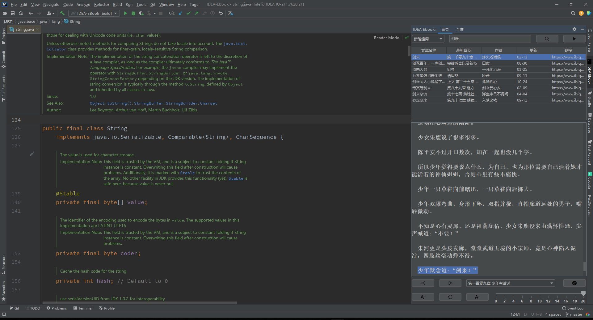
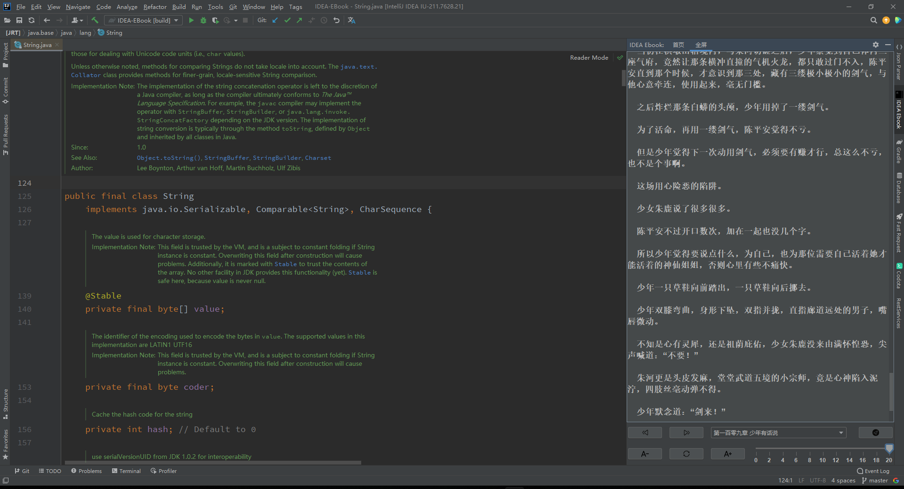

# 📘 IDEA EBook

可以在 IDEA 中看电子书的摸鱼插件、你甚至可以用 IDEA 写代码。

## 🔎搜索 

搜索数据来源于[新笔趣阁](https://www.ibiquge.la)、[妙笔阁](https://www.imiaobige.com)，如有侵权请联系作者删除

## 🎫使用说明

- 安装该插件后，单击屏幕右侧的IDEA EBook 按钮

- 在顶部搜索框中输入书名，然后单击右侧的搜索 按钮

- 左上角下拉列表可以调整数据爬取站点，默认为 新笔趣阁

- 单击搜索结果的行使其突出显示。 点击右上角以开始阅读按钮开始阅读第一章

- 底部章节下拉列表，选择指定章节，然后单击右侧跳转按钮 执行章节跳转

-   用来切换上下章节

-   用于调整字体大小
-   标尺用于调节阅读时鼠标滚动间距

- 顶部“全屏” 与 “首页” 用于切换为全屏阅读和搜索视图

-  用于 “全屏” 与 “首页” 两种视图切换时 同步阅读进度

## :moneybag:捐赠支持

如果你觉得这个项目给你带来了乐趣，你可以请作者喝杯咖啡表示鼓励 ☕

