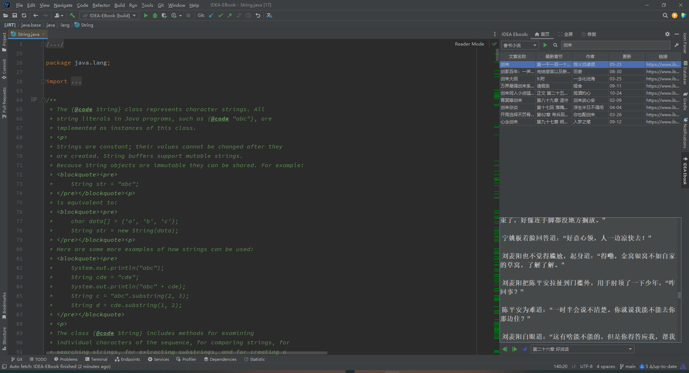
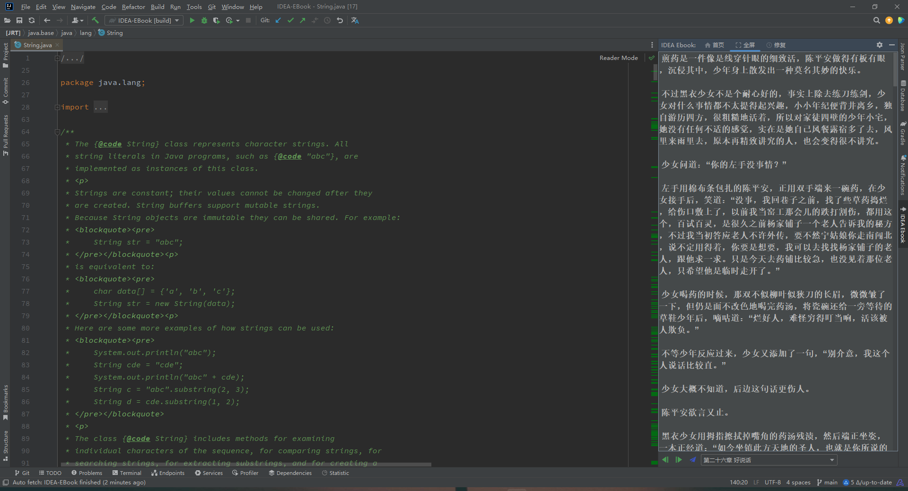
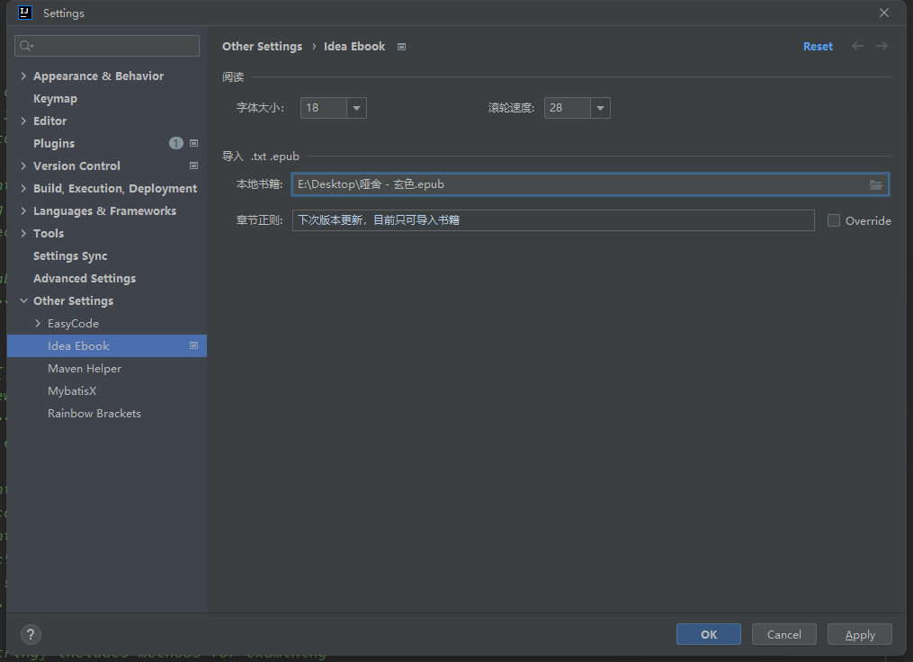

#  IDEA EBook

可以在 IDEA 中看电子书的摸鱼插件、你甚至可以用 IDEA 写代码。

## 🔎 搜索 

搜索数据来源于[新笔趣阁](https://www.ibiquge.la)、[妙笔阁](https://www.imiaobige.com)，如有侵权请联系作者删除

## 📦 安装

### 🗺️ 在线安装
- Jetbrains ide:     `File` > `Settings` > `Plugins` > `Marketplact`  搜索  IDEA EBook

### 🧶 离线安装
- [IDEA EBook](https://plugins.jetbrains.com/plugin/15870-idea-ebook) 下载对应你 ide 的版本
- Jetbrains ide:     `File` > `Settings` > `Plugins` > ⚙️ > `Install Plugin from Disk` 选中下载的 IDEA EBook-{version}.zip 文件

## 🎫 使用说明

- 安装该插件后，单击屏幕右侧的 IDEA EBook  按钮
- 在顶部搜索框中输入书名，然后单击右侧的搜索  按钮
- 左上角下拉列表可以调整数据爬取站点，默认为 笔趣阁
- 单击搜索结果的行使其突出显示。 点击右上角以开始阅读按钮  开始阅读第一章
- 底部章节下拉列表，选择指定章节，然后单击右侧跳转按钮  执行章节跳转
-   用来切换上下章节
- 顶部“全屏” 与 “首页” 用于切换为全屏阅读和搜索视图

## ⚙︎设置

在首页视图中，右上角有个  图标，用于打开设置页面，设置页面可以调增页面阅读字体的大小和滚轮的速度：

## 📥书籍导入

在设置页面除了字体大小和滚轮速度参数设置之外，还可以导入本地的书籍。目前书籍导致仅支持 `.txt` `epub` 这两种书籍格式

## 🏗️ 添砖加瓦
### ✂️ 分支说明

IDEA EBook 的源码分为两个分支：

| 分支    | 描述                                               |
|--------|---------------------------------------------------------------|
| main   | main分支不接受任何pr或修改。 |
| dev    | development分支，默认下一个SNAPSHOT版本，接受修改或pr |

## 💳 捐赠支持

如果你觉得这个项目给你带来了乐趣，可以捐赠请维护者吃包辣条~，在此表示感谢。

